# ComfyUI-NO8D-controls

[](./LICENSE)
[](https://github.com/no8d/ComfyUI-NO8D-controls)

English | [简体中文](./README.zh-CN.md)

This custom node pack provides an end-to-end optimization solution covering the entire workflow from image loading to image generation. It redesigns key nodes for image generation, LoRA stacking, prompt generation, and more to simplify ComfyUI workflow construction, improve generation efficiency across nodes, and significantly lower the barrier to building and using workflows.

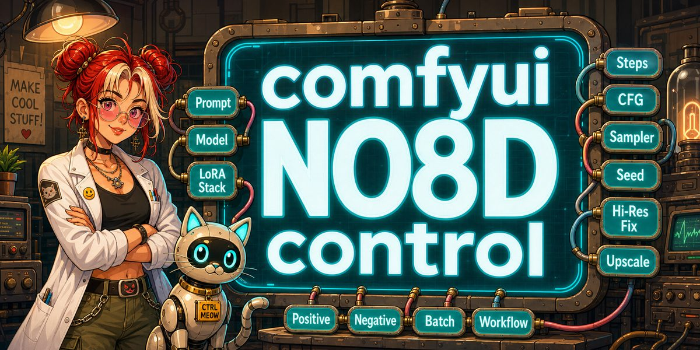

## Quick navigation

[Installation](#installation) · [Nodes](#nodes) · [Prompt API & LLM](#prompt-api-and-llm-configuration) · [More tips](#more-tips-and-experimental-nodes) · [License](#license) · [Star History](#star-history)

## Installation

Clone the repository into `ComfyUI/custom_nodes`:

```bash
cd ComfyUI/custom_nodes
git clone https://github.com/no8d/ComfyUI-NO8D-controls.git
```

Restart ComfyUI and hard-refresh the browser page. No frontend build step is required.

An example workflow is included at [examples/NO8D-controls-example.json](examples/NO8D-controls-example.json).

You can also follow NO8D on [Patreon](https://patreon.com/no8d) for project updates.

## Nodes

All nodes are available under the `NO8D-control` or `NO8D-controls` category.

### NO8D-Krea2 Style Selector

Browse Krea 2 styles visually and output the complete prompt for the selected style.

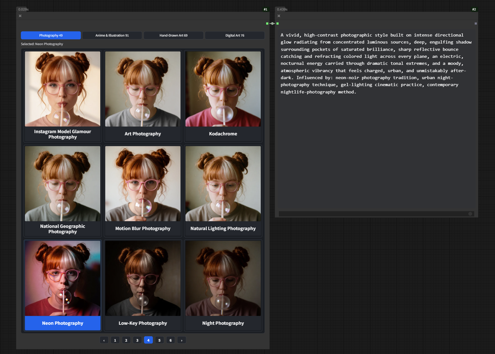

- Groups 285 styles into Photography, Anime & Illustration, Hand-Drawn Art, and Digital Art.
- Shows nine responsive previews per page with mouse and keyboard navigation.
- When the gallery is focused, use the arrow keys to move through the 3×3 grid, including across page boundaries.
- Use `PageUp` / `PageDown` to switch pages while keeping the same grid position, and `Home` / `End` to select the first or last style in the current category.
- Displays localized style names while preserving the original English prompt output.

### NO8D-LoRA stack

Manage multiple LoRAs in one node and apply them to a model without a CLIP input.

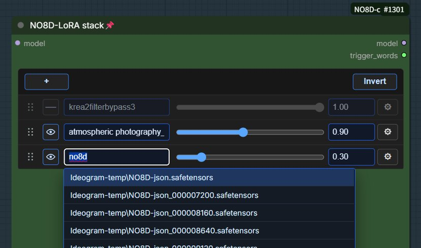

- Add, remove, enable, disable, and reorder LoRAs.
- Adjust strength and custom slider ranges.
- Merge trigger words from enabled LoRAs into one text output.

### NO8D-Prompt

Expand text, analyze a reference image, or combine both into a complete positive prompt through a configured API.

> **Before first use:** This node is an API client and does not include an LLM. Configure an OpenAI-compatible API or a local Ollama service first. See [Prompt API and LLM configuration](#prompt-api-and-llm-configuration).

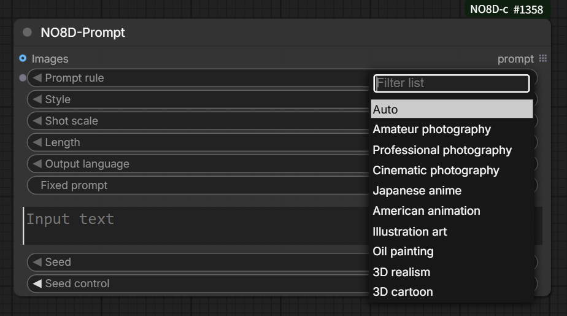

- Supports text-only, image-only, and text-plus-image input.
- Provides style, shot-scale, and prompt-length controls.
- Allows separate text and vision model selection.
- Text-only prompting requires a text-capable LLM; reference-image analysis requires a vision-capable multimodal model.

### NO8D-Prompt-view

Display and edit prompt text before sending it downstream.

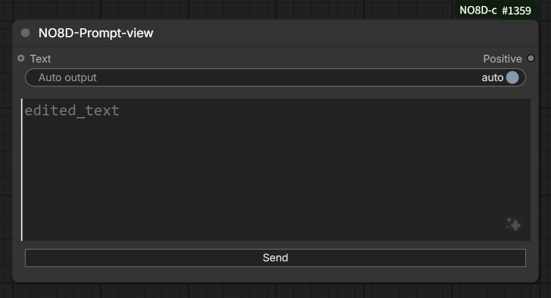

- Automatically displays incoming prompt text.
- Supports a fixed prompt that is prepended whenever the node emits text.
- Supports manual editing and one-click downstream sending.
- Can temporarily stop automatic text output without losing the editor content.

### NO8D-Load-images

Load and organize one or more local images as a ComfyUI list output.

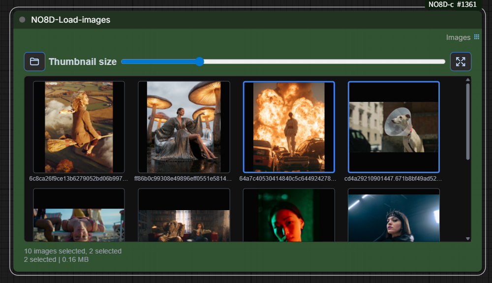

- Add images by file picker, drag-and-drop, or clipboard paste.
- Automatically selects the first image in each newly imported batch.
- Select, reorder, and preview individual images.
- Sends only selected images downstream; selecting all outputs all images, while selecting none produces no output.

### NO8D-Generate

Combine ComfyUI sampling controls, image preview, and mask-based inpainting in one compact node.

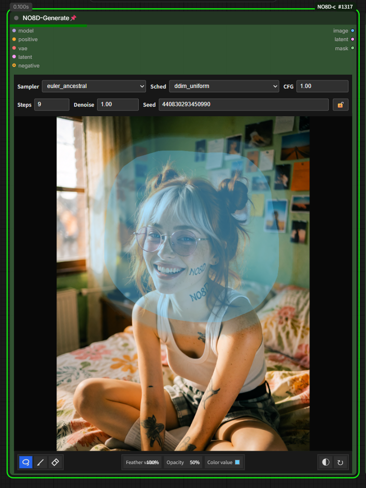

- Controls sampler, scheduler, steps, CFG, denoise, and seed.
- Supports brush, lasso, eraser, feather, opacity, invert, and clear tools.
- Automatically uses inpainting when the canvas contains a mask.
- Outputs the final generated image.

### NO8D-A/B preview

Compare two image streams with an interactive split preview.

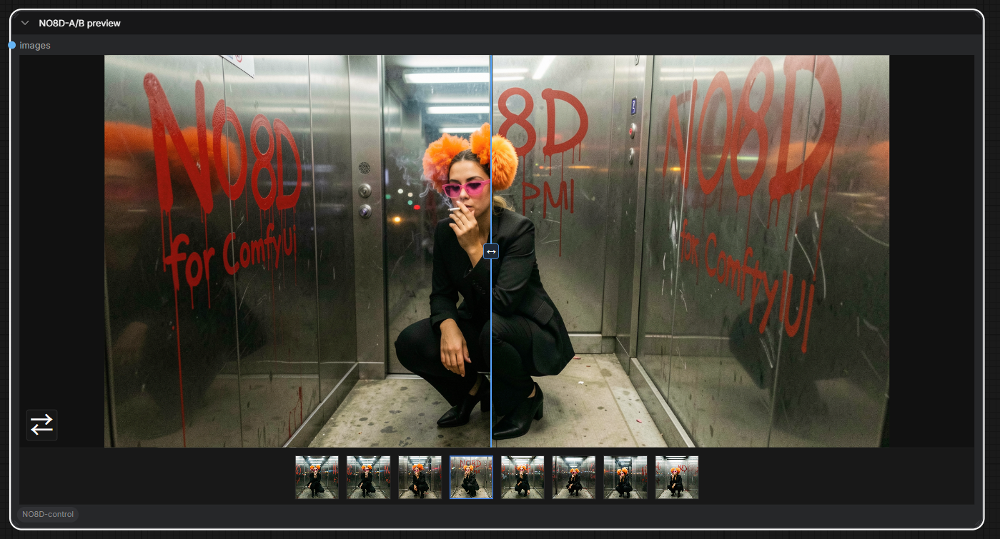

- Displays image A and image B with their original dimensions.
- Supports list-page switching and single-stream history comparison.
- Can pass image A downstream or disable that output branch.

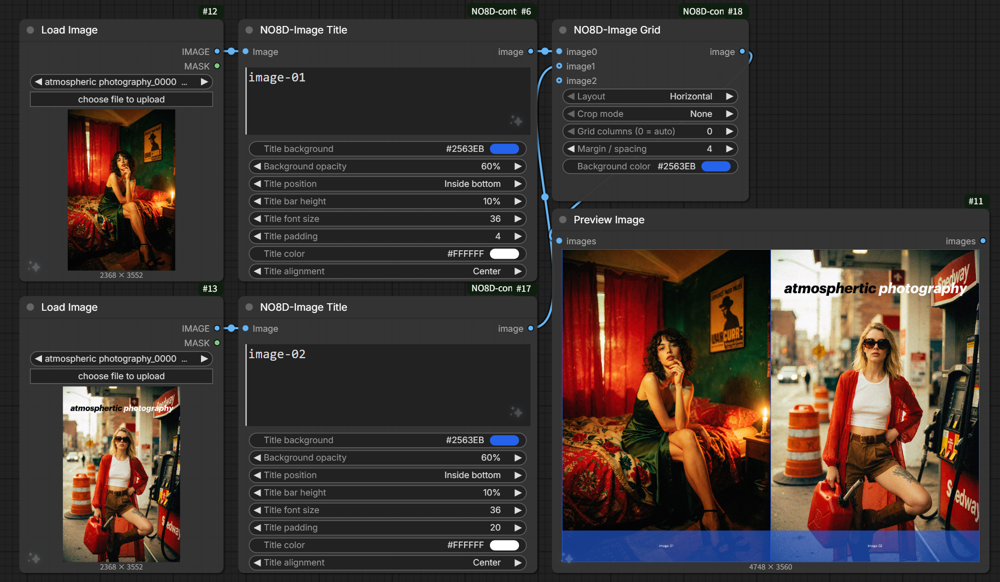

### NO8D Image Grid

Combine multiple image inputs or image batches into one image.

- Arrange images horizontally, vertically, or in an automatic grid using the first image as the size reference.
- Standard, left, center, and right crop modes keep the combined image content at the first image dimensions.
- Crop modes expand the canvas for outer margins and center spacing, preserving image content and filling added areas with the background color.
- Cropped images follow the layout direction: horizontal splits left/right, while vertical and one-column grids split top/bottom.
- Use one value for the outer margin and image spacing; grid padding uses a darkened background color.

### NO8D Image Title

Add title bars outside the top or bottom edge, or overlay a title across the middle.

- Set independent batch titles with one line per image; an entirely blank title list returns the source unchanged.
- Control the title background, opacity, position, height, font size, padding, text color, and alignment.
- Top and bottom bars increase output height; middle titles preserve the source dimensions.
- Inner top and inner bottom positions overlay the image edges without changing output dimensions.
- Title-bar opacity and height use percentages; bar height is relative to the source image height.

### NO8D save

Save images and matching captions for image-text datasets.

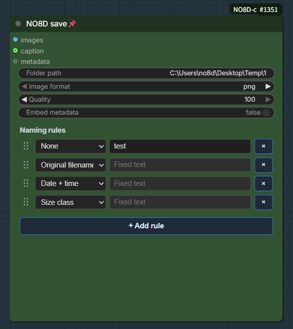

- Builds filenames from fixed text, source filename, date/time, and size class.
- Supports drag-to-reorder filename parts.
- Saves caption text alongside each image.

### NO8D-Empty latent

Create empty latents using common model-family and aspect-ratio presets.

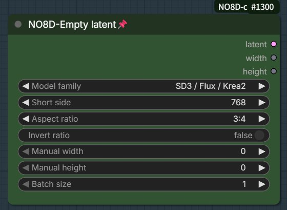

- Supports SD/SDXL, SD3/Flux/Krea2, and Flux2 presets.
- Provides portrait and landscape aspect ratios.
- Outputs the latent together with its calculated width and height.

## Prompt API and LLM configuration

`NO8D-Prompt` sends your text or reference image to a configured large language model (LLM), then returns the generated prompt. It can connect to an OpenAI-compatible API or a locally running Ollama service.

### 1. Open the API Manager

Open **ComfyUI Settings**, select **NO8D-control** in the left sidebar, then click **API Manager** under **Prompt API configuration** in the Prompt panel.

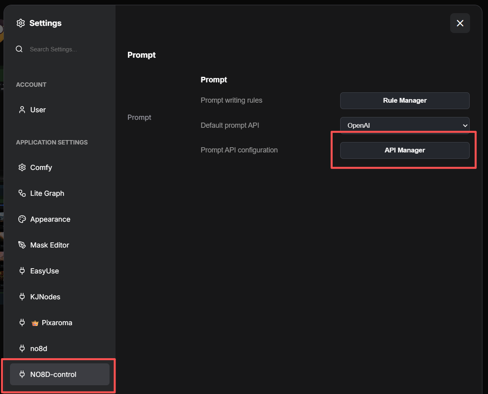

### 2. Add and validate a service

1. Select an existing service on the left, or click **+ Add service**.
2. Choose **OpenAI-compatible API** or **Local LLM (Ollama)** as the service type.
3. Enter the provider's **Base URL** and **API key** if required. A local Ollama service does not require an API key.
4. Click **Validate API**. After validation succeeds, choose the available text and vision models.
5. Click **Save**.

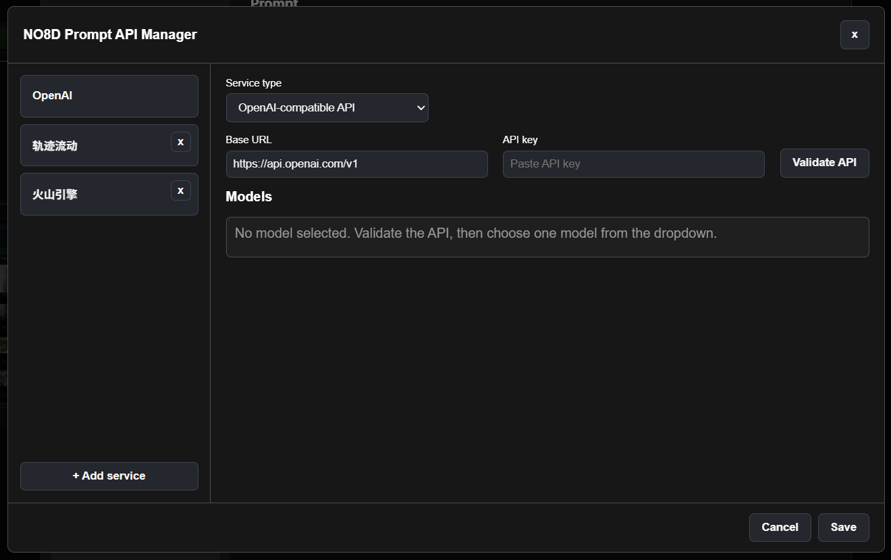

### 3. Choose the right model

- **Text model:** used for text expansion and text-only prompt generation.
- **Vision model:** used for image-only and text-plus-image prompting; it must support image input.
- A multimodal model may be selected for both roles if it supports text and image input.

After saving, return to the Prompt settings page and select the service under **Default prompt API**. If no models appear, check the Base URL and API key, then validate the service again. For Ollama, make sure Ollama is running and the required model is already installed locally.

API keys remain in the local ComfyUI environment and should never be committed to the repository.

## More tips and experimental nodes

For more usage tips, workflow ideas, and experimental NO8D nodes, visit [Patreon](https://patreon.com/no8d). You can also follow ongoing updates and support the project's continued development there.

## License

MIT. See [LICENSE](./LICENSE).

## Star History

<a href="https://www.star-history.com/?repos=no8d%2FComfyUI-NO8D-controls&type=date&legend=top-left">
  <picture>
    <source media="(prefers-color-scheme: dark)" srcset="https://api.star-history.com/svg?repos=no8d/ComfyUI-NO8D-controls&type=Date&theme=dark">
    <source media="(prefers-color-scheme: light)" srcset="https://api.star-history.com/svg?repos=no8d/ComfyUI-NO8D-controls&type=Date">
    
  </picture>
</a>
