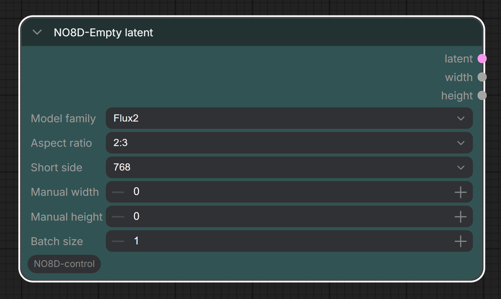

# ComfyUI-NO8D-control

[](./LICENSE)
[](https://github.com/no8d/ComfyUI-NO8D-controls)

English | [简体中文](./README.zh-CN.md)


ComfyUI-NO8D-control is a ComfyUI custom node pack for LoRA control, inpainting, A/B image comparison, and prompt expansion or image caption reverse engineering through an OpenAI-compatible API.

It is designed for practical image iteration: adjust LoRA weights, draw local masks, compare image versions, and prepare positive prompts without leaving the ComfyUI workflow.


All nodes are available under the `NO8D-control` category.

## User Guides

- [6/25 user guide](https://www.patreon.com/no8d/posts/my-first-nodes-161975407?utm_medium=clipboard_copy&utm_source=copyLink&utm_campaign=postshare_creator&utm_content=join_link)
- [6/29 user guide](https://www.patreon.com/no8d/posts/no8d-control-has-162321185?utm_medium=clipboard_copy&utm_source=copyLink&utm_campaign=postshare_creator&utm_content=join_link)

## Nodes

- `NO8D-LoRA stack`
- `NO8D-Inpainting`
- `NO8D-A/B preview`
- `NO8D-Load-images`
- `NO8D-Prompt`
- `NO8D-Prompt-view`
- `NO8D save`
- `NO8D-Empty latent`

## Installation

Clone this repository into your ComfyUI `custom_nodes` directory:

```bash
cd ComfyUI/custom_nodes
git clone https://github.com/no8d/ComfyUI-NO8D-controls.git
```

Restart ComfyUI after installation, then hard refresh the browser page.

No frontend build step is required. The nodes use ComfyUI's existing Python and browser extension environment.

## Basic Workflow

```text
Checkpoint Loader
    MODEL -> NO8D-LoRA stack -> MODEL -> NO8D-Inpainting -> IMAGE
    IMAGE A + IMAGE B -> NO8D-A/B preview
```

Connect `positive`, `negative`, `vae`, and `latent` to `NO8D-Inpainting`. If LoRA control is not needed, connect the original model directly to `NO8D-Inpainting`.

Prompt workflow:

```text
Text, image, or image batch -> NO8D-Prompt -> NO8D-Prompt-view or dataset save
```

Batch caption workflow:

```text
NO8D-Load-images -> NO8D-Prompt -> NO8D save
```

## NO8D-Empty Latent

`NO8D-Empty latent` creates an empty latent with common aspect ratios and short-side sizes.



Features:

- Choose a model family: SD/SDXL, SD3/Flux/Krea2, or Flux2.
- Choose common aspect ratios: 1:2, 9:16, 2:3, 3:4, 1:1, 4:3, 3:2, 16:9, and 2:1.
- Choose a common short-side size.
- Optionally enter manual width and height. If both are set, they override the aspect ratio. If only one is set, the other side is calculated from the selected aspect ratio.
- Output the latent together with the calculated width and height.

## NO8D-LoRA Stack

`NO8D-LoRA stack` loads LoRAs and controls LoRA weights. It does not need a CLIP input.


Features:

- Add multiple LoRAs in one node.
- Apply LoRAs in list order.
- Adjust each LoRA weight with a slider or numeric input.
- Set custom min/max ranges for each LoRA slider.
- Enable or disable individual LoRAs.
- Invert all enabled states.
- Reorder LoRAs by dragging the handle.
- Keep only one settings panel open at a time.

Disabled entries, `None`, and zero-weight entries are skipped. Loaded LoRA files are cached per node instance and released when removed from the stack.

This node works with ordinary LoRAs and Slider LoRAs. NO8D publishes Slider LoRAs here:

[huggingface.co/NO8D](https://huggingface.co/NO8D)

## NO8D-Inpainting

`NO8D-Inpainting` combines KSampler-style sampling, image preview, and mask drawing.

It does not load LoRAs by itself. LoRA changes should come from `NO8D-LoRA stack` or another upstream model node.


Controls:

- Sampler and scheduler
- Steps and CFG
- Seed randomization or lock
- Brush and lasso mask tools
- Brush size, feather, mask color, and denoise strength
- Invert mask and clear mask

When a mask tool is enabled, the node temporarily locks the seed so the base image stays stable while drawing. Turning the mask tool off restores the previous seed mode.

## NO8D-A/B Preview

`NO8D-A/B preview` compares two connected image inputs.


Features:

- Drag the split line to compare two images.
- Swap A/B sides.
- Use temporary ComfyUI preview images instead of writing permanent files.

## NO8D-Prompt

`NO8D-Prompt` uses a configured OpenAI-compatible API to expand text prompts or reverse-engineer one or more input images into captions.


Inputs:

- `text`: optional text input for prompt expansion or image-caption guidance.
- `images`: optional single-image or image-batch input for caption reverse engineering.
- `prompt_rules`: choose a writing rule.
- `style_preset`: choose the requested prompt style. Available presets are amateur photography, professional photography, cinematic photography, Japanese anime, American animation, illustration art, oil painting, photorealistic 3D, and stylized 3D cartoon.
- `length_preset`: choose standard or detailed length.
- `output_language`: choose English or Chinese output.
- `seed`: controls variation in each generated prompt or caption.
- `extra_rules`: optional per-node instructions.

Outputs:

- `prompt`: a string list. Text-only input returns one item; image batches return one prompt per image.

Built-in rule types:

- `自然语言`: outputs one fluent modern-English positive prompt paragraph.
- `json结构`: outputs readable structured English JSON.

If both text and images are connected, images are treated as visual evidence and the text is treated as user intent, correction, or emphasis. Images are compressed before being sent to the API to reduce request size and latency.

## NO8D-Load-images

`NO8D-Load-images` loads multiple local images and outputs them as an image batch for captioning or dataset workflows.


Features:

- Load images from the system file picker.
- Add images by dragging files onto the node.
- Preview selected images with adjustable thumbnails.
- Select, multi-select, box-select, delete, and reorder loaded images.
- Double-click an image to run a single-image output.

The node preserves source filename metadata so `NO8D save` can reuse original filenames.

## NO8D save

`NO8D save` saves image and text pairs as an image-text dataset with configurable naming rules.


Inputs:

- `images`: image batch input.
- `caption`: optional caption input. If it is not connected, the node saves images only.

Options:

- Choose output folder, image format, and quality.
- Build filenames from ordered naming rules.
- Use original filename, date + time, size class, or fixed text.
- Drag the six-dot handle to reorder naming rules.
- Duplicate filenames are resolved with a six-digit suffix.

## NO8D-Prompt-View

`NO8D-Prompt-view` displays and optionally edits prompt text.


- `Auto output` on: pass received text through automatically.
- `Auto output` off: block downstream execution until the `Send` button is clicked.
- `Send`: queues downstream nodes with the edited text without rerunning the upstream prompt generation node.

This node can also be used as a simple manual text input node.

## Community

- QQ group: `482570609`
- WeChat: `fattyleoliu`


## Prompt API Settings

Prompt API settings live in ComfyUI settings, not inside every node.

Open ComfyUI settings and find `NO8D-control / Prompt`.

Available settings:

- Rule Manager: edit built-in prompt writing rules or add custom rules.
- Default Prompt API: choose the default service.
- API Manager: add, edit, delete, validate, and select OpenAI-compatible API services.
- Model list: after API validation, choose one model from a searchable model list.

The config is stored in the ComfyUI user directory:

```text
default/no8d-control/config/prompt_api.json
```

This file is local user configuration and should not be committed to the repository.

## ComfyUI Interaction Policy

The extension keeps custom frontend behavior narrow and relies on standard ComfyUI behavior where possible.

- It does not override ComfyUI's global queue or canvas methods.
- Canvas panning, wheel events, context menus, and global shortcuts are passed back to ComfyUI whenever possible.
- `NO8D-Inpainting` captures pointer input only while drawing a mask.
- `NO8D-LoRA stack` captures interaction only on real controls such as buttons, sliders, inputs, and drag handles.
- `Ctrl/Cmd + Enter` can still queue a ComfyUI run when an input field is focused.

## Notes

- LoRA weight changes are linear at the model delta level, but visual results are not guaranteed to change linearly.
- Backend node IDs are kept stable to avoid breaking existing workflows.

## Feedback

NO8D is not a professional software developer. This node pack was built with the help of Codex through practical testing, debugging, and iteration inside real ComfyUI workflows.

Please use [GitHub Issues](https://github.com/no8d/ComfyUI-NO8D-controls/issues) for reproducible bugs and feature requests. Before contributing code, please read [CONTRIBUTING.md](./CONTRIBUTING.md).

You can support NO8D and discuss LoRA control, Slider LoRA, and inpainting workflows through the [NO8D Patreon community](https://patreon.com/no8d?utm_medium=unknown&utm_source=join_link&utm_campaign=creatorshare_creator&utm_content=copyLink).

## Acknowledgements

Thanks to [ComfyUI](https://github.com/comfyanonymous/ComfyUI) and its community for the node system, sampling tools, preview pipeline, and extension mechanism.

The early idea and direction of `NO8D-Inpainting` were inspired by [shootthesound/ComfyUI-Angelo](https://github.com/shootthesound/ComfyUI-Angelo). Thank you to the original author for the inspiration.

Thanks to Patreon community member **Wylmquest** for suggestions during development.

## License

This project is released under the [MIT License](./LICENSE).
