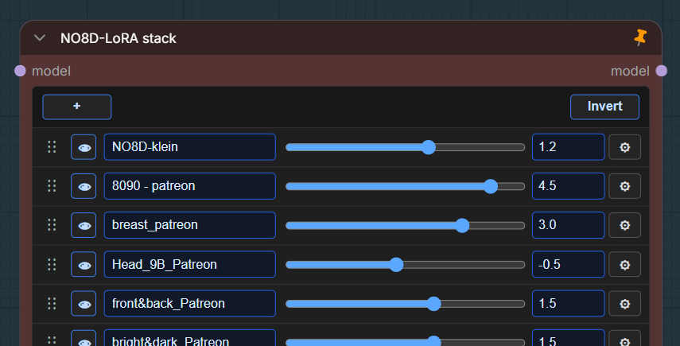
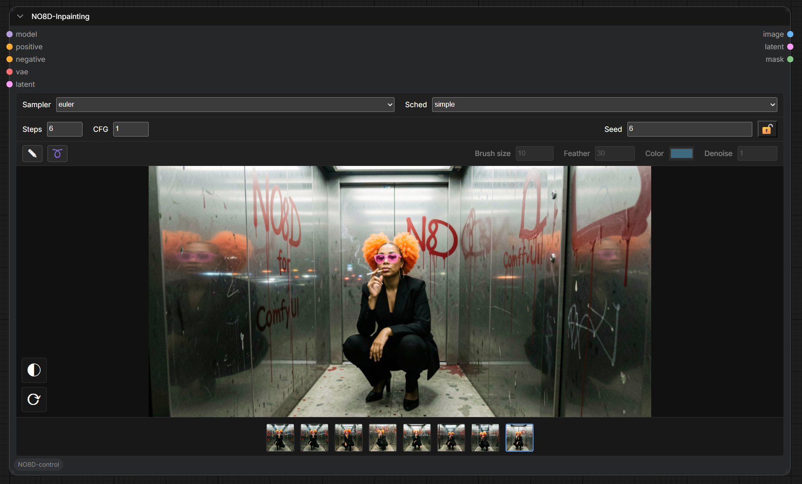

# ComfyUI-NO8D-control

[](./LICENSE)
[](https://github.com/NO8D/ComfyUI-NO8D-control)

English | [简体中文](./README.zh-CN.md)


ComfyUI-NO8D-control is a ComfyUI custom node pack for LoRA control, inpainting, A/B image comparison, and prompt expansion or image caption reverse engineering through an OpenAI-compatible API.

It is designed for practical image iteration: adjust LoRA weights, draw local masks, compare image versions, and prepare positive prompts without leaving the ComfyUI workflow.


All nodes are available under the `NO8D-control` category.

## Nodes

- `NO8D-LoRA stack`
- `NO8D-Inpainting`
- `NO8D-A/B preview`
- `NO8D-Prompt-plus`
- `NO8D-Batch-Prompt-plus`
- `NO8D-Prompt-view`

## Installation

Clone this repository into your ComfyUI `custom_nodes` directory:

```bash
cd ComfyUI/custom_nodes
git clone https://github.com/NO8D/ComfyUI-NO8D-control.git
```

Restart ComfyUI after installation, then hard refresh the browser page.

No frontend build step is required. The nodes use ComfyUI's existing Python and browser extension environment.

## Basic Workflow

```text
Checkpoint Loader
    MODEL -> NO8D-LoRA stack -> MODEL -> NO8D-Inpainting -> IMAGE -> NO8D-A/B preview
```

Connect `positive`, `negative`, `vae`, and `latent` to `NO8D-Inpainting`. If LoRA control is not needed, connect the original model directly to `NO8D-Inpainting`.

Prompt workflow:

```text
Text or image -> NO8D-Prompt-plus -> NO8D-Prompt-view -> positive prompt input
```

Batch caption workflow:

```text
Image batch -> NO8D-Batch-Prompt-plus -> Save Image-Text (to Folder)
```

## NO8D-LoRA Stack

`NO8D-LoRA stack` loads LoRAs and controls LoRA weights. It does not need a CLIP input.



Features:

- Add multiple LoRAs in one node.
- Apply LoRAs in list order.
- Adjust each LoRA weight with a slider or numeric input.
- Set custom min/max ranges for each LoRA slider.
- Enable or disable individual LoRAs.
- Invert all enabled states.
- Reorder LoRAs by dragging the handle.
- Keep only one settings panel open at a time.

Disabled entries, `None`, and zero-weight entries are skipped. Loaded LoRA files are cached per node instance and released when removed from the stack.

This node works with ordinary LoRAs and Slider LoRAs. NO8D publishes Slider LoRAs here:

[huggingface.co/NO8D](https://huggingface.co/NO8D)

## NO8D-Inpainting

`NO8D-Inpainting` combines KSampler-style sampling, image preview, mask drawing, and limited local-edit history.

It does not load LoRAs by itself. LoRA changes should come from `NO8D-LoRA stack` or another upstream model node.



Controls:

- Sampler and scheduler
- Steps and CFG
- Seed randomization or lock
- Brush and lasso mask tools
- Brush size, feather, mask color, and denoise strength
- Invert mask and clear mask
- Session history strip

Clearing the mask accepts the current edited result as the new base image for the next local edit. Before clearing, changing LoRA weight or sampling settings recomputes the current masked edit from the same base image.

History is session-only and uses ComfyUI preview references. It does not write permanent images into this repository.

## NO8D-A/B Preview

`NO8D-A/B preview` compares the current image against the previous image or a selected session-history image.


Features:

- Drag the split line to compare two images.
- Swap A/B sides.
- Keep up to 8 session-history images.
- Restore recent history within the current browser session.
- Use temporary ComfyUI preview images instead of writing permanent files.

## NO8D-Prompt-Plus

`NO8D-Prompt-plus` uses a configured OpenAI-compatible API to generate a positive prompt.


Inputs:

- `text`: optional text input for prompt expansion.
- `image`: optional image input for image caption reverse engineering.
- `prompt_rules`: choose a writing rule.
- `seed`: controls variation in the generated prompt.
- `extra_rules`: optional per-node instructions.
- `style_preset`: choose the requested prompt style. Available presets are amateur photography, professional photography, cinematic photography, Japanese anime, American animation, illustration art, oil painting, photorealistic 3D, and stylized 3D cartoon.

There is no built-in user prompt text box. Use `NO8D-Prompt-view`, another text node, or any compatible text output as the text input.

Built-in rule types:

- `自然语言`: outputs one fluent modern-English positive prompt paragraph.
- `json结构`: outputs readable structured English JSON.

If both text and image are connected, the image is treated as visual evidence and the text is treated as user intent, correction, or emphasis.

For image reverse engineering, the node compresses the input image before sending it to the API to reduce request size and latency.

## NO8D-Batch-Prompt-Plus

`NO8D-Batch-Prompt-plus` uses the same prompt rules, style presets, length presets, and API settings as `NO8D-Prompt-plus`, but reverse-engineers every image in an input batch.

Inputs:

- `images`: image batch input.
- `prompt_rules`: choose a writing rule.
- `style_preset`: choose the requested prompt style.
- `length_preset`: choose standard or detailed length.
- `output_language`: choose English or Chinese output.
- `seed`: controls variation in each generated caption.
- `extra_rules`: optional per-node instructions.

Outputs:

- `captions`: a string list, one caption per image. Connect it to ComfyUI's built-in `Save Image-Text (to Folder)` node to save images and matching `.txt` captions.
- `combined`: all captions joined into one readable text block for previewing with `NO8D-Prompt-view` or another text preview node.

This node has no text input port. It is dedicated to batch image caption reverse engineering.

## NO8D-Prompt-View

`NO8D-Prompt-view` displays and optionally edits prompt text.


- `Auto output` on: pass received text through automatically.
- `Auto output` off: block downstream execution until the `Send` button is clicked.
- `Send`: queues downstream nodes with the edited text without rerunning the upstream prompt generation node.

This node can also be used as a simple manual text input node.

## Prompt API Settings

Prompt API settings live in ComfyUI settings, not inside every node.

Open ComfyUI settings and find `NO8D-control / Prompt`.

Available settings:

- Rule Manager: edit built-in prompt writing rules or add custom rules.
- Default Prompt API: choose the default service.
- API Manager: add, edit, delete, validate, and select OpenAI-compatible API services.
- Model list: after API validation, choose one model from a searchable model list.

The config is stored in the ComfyUI user directory:

```text
default/no8d-control/config/prompt_api.json
```

This file is local user configuration and should not be committed to the repository.

## ComfyUI Interaction Policy

The extension keeps custom frontend behavior narrow and relies on standard ComfyUI behavior where possible.

- It does not override ComfyUI's global queue or canvas methods.
- Canvas panning, wheel events, context menus, and global shortcuts are passed back to ComfyUI whenever possible.
- `NO8D-Inpainting` captures pointer input only while drawing a mask.
- `NO8D-LoRA stack` captures interaction only on real controls such as buttons, sliders, inputs, and drag handles.
- `Ctrl/Cmd + Enter` can still queue a ComfyUI run when an input field is focused.

## Notes

- LoRA weight changes are linear at the model delta level, but visual results are not guaranteed to change linearly.
- Runtime edit state is stored in the active node instance. Restarting ComfyUI clears in-memory edit history.
- `NO8D-A/B preview` keeps temporary session history only.
- Backend node IDs are kept stable to avoid breaking existing workflows.

## Feedback

NO8D is not a professional software developer. This node pack was built with the help of Codex through practical testing, debugging, and iteration inside real ComfyUI workflows.

Please use [GitHub Issues](https://github.com/NO8D/ComfyUI-NO8D-control/issues) for reproducible bugs and feature requests. Before contributing code, please read [CONTRIBUTING.md](./CONTRIBUTING.md).

You can support NO8D and discuss LoRA control, Slider LoRA, and inpainting workflows through the [NO8D Patreon community](https://patreon.com/no8d?utm_medium=unknown&utm_source=join_link&utm_campaign=creatorshare_creator&utm_content=copyLink).

## Acknowledgements

Thanks to [ComfyUI](https://github.com/comfyanonymous/ComfyUI) and its community for the node system, sampling tools, preview pipeline, and extension mechanism.

The early idea and direction of `NO8D-Inpainting` were inspired by [shootthesound/ComfyUI-Angelo](https://github.com/shootthesound/ComfyUI-Angelo). Thank you to the original author for the inspiration.

Thanks to Patreon community member **Wylmquest** for suggestions during development.

## License

This project is released under the [MIT License](./LICENSE).
