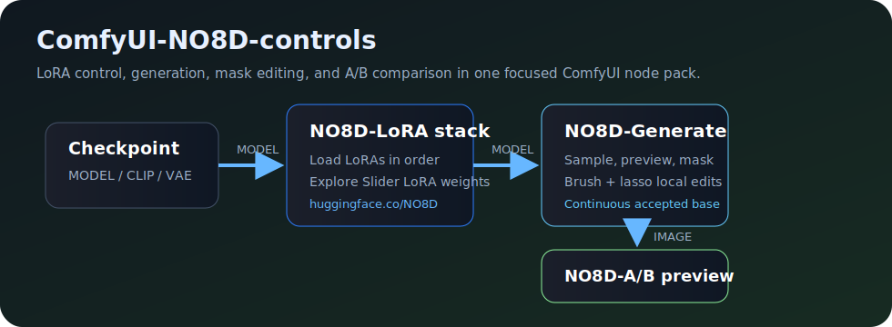
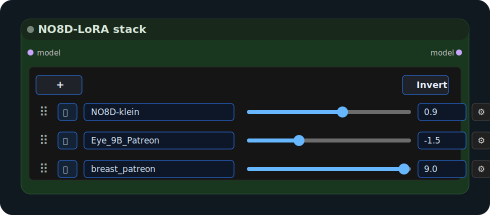
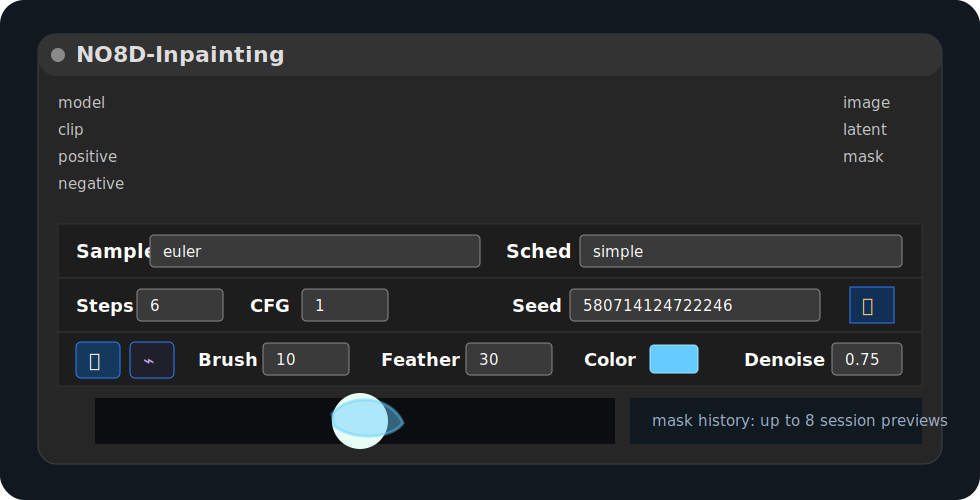
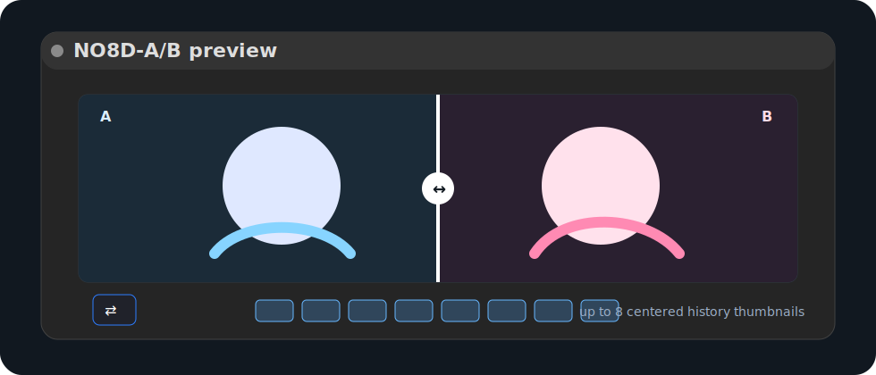

# ComfyUI-NO8D-control

[](./LICENSE)
[](https://github.com/NO8D/ComfyUI-NO8D-control)

English | [简体中文](./README.zh-CN.md)

ComfyUI-NO8D-control is a ComfyUI custom node pack for LoRA control, inpainting, and fast A/B image comparison.

It is designed for ordinary LoRA and Slider LoRA workflows. The main goal is simple: make it easier to see how LoRA selection, LoRA weight, masks, seeds, and local edit parameters affect the same image.



The node pack contains three nodes:

- `NO8D-LoRA stack`
- `NO8D-Inpainting`
- `NO8D-A/B preview`

All nodes are available under the `NO8D-control` category in ComfyUI.

## Installation

Clone this repository into your ComfyUI `custom_nodes` directory:

```bash
cd ComfyUI/custom_nodes
git clone https://github.com/NO8D/ComfyUI-NO8D-control.git
```

Restart ComfyUI after installation, then hard refresh your browser page.

This node pack uses the Python and frontend environment already provided by ComfyUI. No extra frontend build step is required.

## Basic workflow

```text
Checkpoint Loader: MODEL
          │
          ▼
NO8D-LoRA stack
          │ MODEL
          ▼
NO8D-Inpainting ── IMAGE ──► NO8D-A/B preview
```

Connect your workflow's `positive`, `negative`, `VAE`, and `LATENT` outputs to `NO8D-Inpainting`.

If you do not need LoRA control, you can connect the original `MODEL` directly to `NO8D-Inpainting`.

## Nodes

### NO8D-LoRA stack

`NO8D-LoRA stack` is responsible only for LoRA loading and LoRA weight control.



Features:

- Add multiple LoRAs in one node.
- Apply LoRAs in list order.
- Adjust each LoRA weight with a slider or numeric input.
- Set custom min/max ranges for each LoRA slider.
- Enable or disable individual LoRAs temporarily.
- Invert the enabled state of all LoRAs.
- Reorder LoRAs by dragging.
- Keep only one LoRA settings panel open at a time.

Disabled entries, `None`, and zero-weight entries are skipped. Loaded LoRA files are cached per node instance and released when removed from the stack.

This node works with ordinary LoRAs and Slider LoRAs. NO8D has trained and published many Slider LoRAs here:

[huggingface.co/NO8D](https://huggingface.co/NO8D)

Those Slider LoRAs are a natural fit for `NO8D-LoRA stack`, because the node is built around quick weight exploration.

### NO8D-Inpainting

`NO8D-Inpainting` handles sampling, image preview, mask drawing, and continuous local editing.

It does not load LoRA by itself. LoRA changes should come from the upstream `NO8D-LoRA stack` or any other ComfyUI model node.



Sampling controls:

- Sampler and scheduler
- Steps
- CFG
- Seed lock/randomization
- Denoise strength

Mask tools:

- Brush
- Lasso
- Brush size
- Feather size
- Mask color
- Denoise strength
- Invert mask
- Clear mask

Default mask/edit values:

| Option | Default |
|---|---:|
| Brush display size | `10` |
| Feather | `30` |
| Mask color | `#66ccff` |
| Denoise before mask drawing | `1.0` |
| Denoise after mask drawing is enabled | `0.75` |

Seed locking keeps the random source stable. If the input image, LoRA stack, mask, or sampling parameters change, ComfyUI still needs to run sampling again. When all relevant inputs stay the same, the node reuses the current edit result instead of doing unnecessary repeated GPU work.

Continuous editing behavior:

```text
A
└─ eye mask + eye LoRA → B
   └─ clear mask, accept B
      └─ ear mask + ear LoRA → C
```

Clearing the mask means accepting the current edited result as the new base image for the next local edit. In the example above, C is edited from B, not from the original A.

Before clearing the mask, changing LoRA weight recomputes the current masked edit from the same base. It does not silently stack weight `2` on top of the previous weight `1` result.

The history strip shows up to 8 images and uses ComfyUI preview references. It does not save permanent images inside the node folder.

### NO8D-A/B preview

`NO8D-A/B preview` compares the current image against the previous image or a selected history image.



Features:

- Drag the split line to compare two images.
- Swap A/B sides.
- Keep up to 8 session history images.
- Center-align history thumbnails.
- Use temporary ComfyUI preview images instead of writing permanent files.

## ComfyUI interaction policy

This node pack tries to keep custom behavior narrow and leave standard ComfyUI behavior to ComfyUI.

- It does not override ComfyUI's global queue or canvas methods.
- Canvas panning, wheel events, context menus, and global shortcuts are passed back to ComfyUI whenever possible.
- `NO8D-Inpainting` only captures pointer input when a mask drawing tool is active and the user is drawing inside the preview.
- `NO8D-LoRA stack` only captures interaction on real controls such as buttons, sliders, inputs, and drag handles.
- `Ctrl/Cmd + Enter` can still queue a ComfyUI run when an input field is focused.

## Notes

- LoRA weight changes are linear at the model delta level, but diffusion sampling and visual results are not guaranteed to look visually linear.
- Runtime edit state is stored in the active node instance. Restarting ComfyUI clears in-memory base/edit history.
- `NO8D-A/B preview` keeps temporary session history only.
- Changing backend node IDs would break existing workflows that use those IDs, so the public IDs are kept stable.

## Screenshots

The current README uses lightweight SVG illustrations stored in `docs/images/`. Real ComfyUI screenshots can be added later in the same folder and referenced with standard Markdown image syntax.

## Feedback

NO8D is not a professional software developer. This node pack was built with the help of Codex, through practical testing, repeated debugging, and a lot of iteration inside real ComfyUI workflows.

If you run into a bug, confusing behavior, compatibility issue, or anything that feels wrong, please let NO8D know. Clear feedback and reproducible examples are especially helpful.

Please use [GitHub Issues](https://github.com/NO8D/ComfyUI-NO8D-control/issues) for reproducible bugs and feature requests. Before contributing code, please read [CONTRIBUTING.md](./CONTRIBUTING.md).

## Acknowledgements

Thanks to [ComfyUI](https://github.com/comfyanonymous/ComfyUI) and its community for the node system, sampling tools, preview pipeline, and extension mechanism that this project builds on.

The early idea and direction of `NO8D-Inpainting` were inspired by [shootthesound/ComfyUI-Angelo](https://github.com/shootthesound/ComfyUI-Angelo). Thank you to the original author for the inspiration.

Thanks to Patreon community member **Wylmquest** for suggestions during development.

You can support NO8D and discuss LoRA control, Slider LoRA, and inpainting workflows through the [NO8D Patreon community](https://patreon.com/no8d?utm_medium=unknown&utm_source=join_link&utm_campaign=creatorshare_creator&utm_content=copyLink).

## License

This project is released under the [MIT License](./LICENSE).
