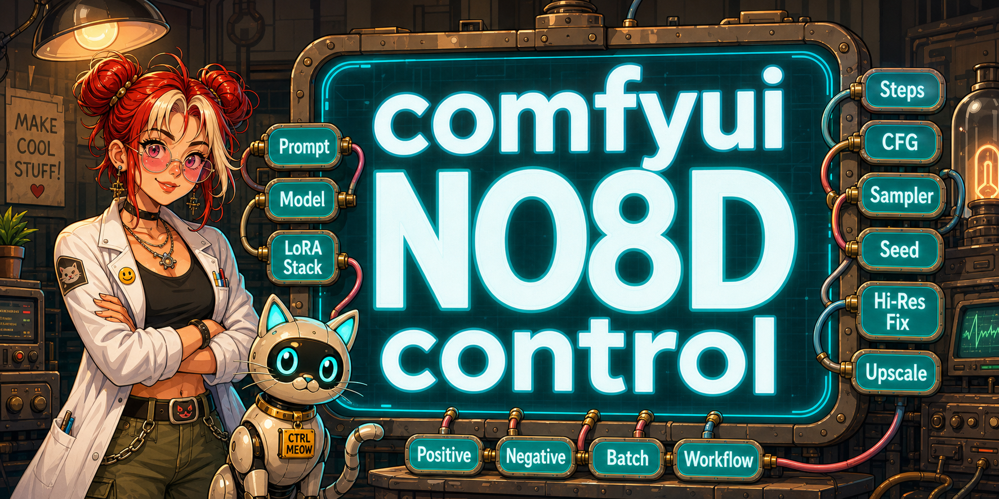

# ComfyUI-NO8D-controls

[English](./README.md) | 简体中文

ComfyUI-NO8D-controls 是一套面向实际出图迭代的 ComfyUI 自定义节点。它把 LoRA 组合控制、提示词扩写、图像载入、带遮罩绘制的生成节点、A/B 对比、空 latent 创建和图文数据集保存整合到一套工作流里。

项目原则是：能用 ComfyUI 原生机制就优先用原生机制，包括节点执行、列表输入、图像预览、右键菜单、队列和图结构展开。只有在原生控件无法满足工作流效率时，才写轻量自定义前端 UI。



## 节点列表

节点位于 `NO8D-control` 或 `NO8D-controls` 分类。

- `NO8D-LoRA stack`
- `NO8D-Prompt`
- `NO8D-提示词预览`
- `NO8D-图像载入`
- `NO8D-Generate`
- `NO8D-A/B preview`
- `NO8D-图文保存`
- `NO8D-空 latent`

## 安装

把仓库克隆到 ComfyUI 的 `custom_nodes` 目录：

```bash
cd ComfyUI/custom_nodes
git clone https://github.com/no8d/ComfyUI-NO8D-controls.git
```

安装后重启 ComfyUI，并在浏览器中强制刷新页面。不需要额外的前端构建步骤。

## 常见连接方式

```text
Checkpoint Loader
  MODEL -> NO8D-LoRA stack -> NO8D-Generate -> IMAGE
  CLIP  -> 提示词编码链路        -> NO8D-Generate
  VAE   -----------------------> NO8D-Generate
  latent ----------------------> NO8D-Generate

NO8D-Generate -> NO8D-A/B preview
NO8D-图像载入 -> NO8D-Prompt -> NO8D-提示词预览 / NO8D-图文保存
```

## 节点说明

### NO8D-LoRA stack

用于在一个节点中组合多个 LoRA，并输出应用 LoRA 后的模型。

- 在一个节点里添加、删除、启用、关闭和排序多个 LoRA。
- 用滑条或数字框调整每个 LoRA 的权重。
- 每个 LoRA 可以设置独立的最小值和最大值。
- 每个 LoRA 可以填写触发词。启用且权重非 0 的 LoRA 会把触发词合并为一个字符串输出。
- 数字框键盘调参规则接近 ComfyUI：方向键小步进，Shift + 方向键大步进。

### NO8D-Prompt

通过配置好的提示词 API，把简短想法、参考图像，或两者一起整理成完整正向提示词。

三种输入情况：

- 只输入文本：在 `输入文本 / Input text` 中写想法，节点会扩写为完整图像提示词。
- 只接入图像：节点会根据图像反推可用提示词。
- 文本 + 图像：文本代表用户意图，图像作为视觉参考；两者冲突时优先遵守文本。

`固定提示词 / Fixed prompt` 用于固定前缀，例如 LoRA 触发词。它会自动追加到生成提示词前面。

### NO8D-提示词预览

显示提示词文本，支持手动编辑，并可把编辑后的文本发送到后续节点。

### NO8D-图像载入

用于把一张或多张本地图像载入工作流。

- 支持点击文件夹按钮选择图像，也支持拖拽图像到节点。
- 支持单选和多选。
- 支持拖动缩略图排序。
- 双击某张图像会只运行该图像。
- 队列运行时：如果有选中图像，则输出选中的图像；如果没有选中图像，则输出全部载入图像。
- 输出采用 ComfyUI list 方式，让下游节点可以按“算完一张再算下一张”的方式处理。

### NO8D-Generate

把 ComfyUI 采样流程封装为一个紧凑生成节点，并提供可编辑的图像/遮罩预览。

- 控制采样器、调度器、步数、CFG、降噪和随机种子。
- 支持种子锁定或随机。
- 支持画笔、套索、橡皮擦、遮罩羽化、透明度、颜色、反转和清除。
- 内部使用 ComfyUI `GraphBuilder` 展开为原生采样/解码节点，因此可以正确处理 list 输入。
- 尽量保留 ComfyUI 原生图像状态，方便右键菜单等原生行为。

### NO8D-A/B preview

用于对比两路图像。

- `image_a` 显示在左侧。
- `image_b` 显示在右侧。
- 如果只接入一路图像，缺失的一侧显示该路上一次运行的图像；第一次运行没有历史图时显示空白。
- 接收到图像列表时，右下角页码可点击切换对比页。

### NO8D-图文保存

用于保存图像和文本，适合整理图文数据集。

- 文件名规则支持固定文本、原文件名、日期时间和尺寸等级。
- 命名规则可以拖动排序。
- 可把提示词或 caption 与图像一起保存。

### NO8D-空 latent

按常见模型类型、比例和短边尺寸创建空 latent。

- 支持 SD/SDXL、SD3/Flux/Krea2、Flux2 等尺寸预设。
- 支持常见竖图比例和反转后的横图比例。
- 输出 latent，同时输出计算后的宽度和高度。

## 提示词 API

Prompt 节点使用 NO8D 提示词设置中的 API 配置，支持 OpenAI 兼容 API 或本地 LLM 兼容接口。

可在设置中完成：

- 配置 API 服务；
- 验证可用模型；
- 选择默认提示词 API；
- 编辑提示词撰写规则。

API key 和本地配置属于本地环境，不要提交到仓库。

## 语种自适应

前端会从 ComfyUI 设置、浏览器 localStorage、页面语言和可见 ComfyUI 文案中判断当前语言。当前支持英文和简体中文。

节点 UI 会在启动时初始化语言，并在浏览器 `storage` 和 `languagechange` 事件发生时刷新标签。项目已经移除周期性语言轮询。

## 开发说明

- Python 节点通过 `NODE_CLASS_MAPPINGS` 注册到 ComfyUI。
- 前端扩展位于 `web/`，由 `WEB_DIRECTORY = "./web"` 加载。
- `NO8D-Generate` 通过 `GraphBuilder` 展开为 ComfyUI 原生采样/解码节点。
- `NO8D-图像载入` 和 `NO8D-Generate` 以 ComfyUI list 执行为核心，不做手写批量循环。
- 后续开发应继续优先使用 ComfyUI 原生行为，避免重复实现预览、队列和图执行机制。

## 发布前检查

建议发布前执行：

```bash
python -m py_compile __init__.py compare_slider_preview.py empty_latent.py generate.py image_loader.py prompt_config.py prompt_plus.py prompt_server.py save_image_text_dataset.py slider_lora_stack.py
node --check web/*.js
git diff --check
```

## 许可证

MIT。详见 [LICENSE](./LICENSE)。
