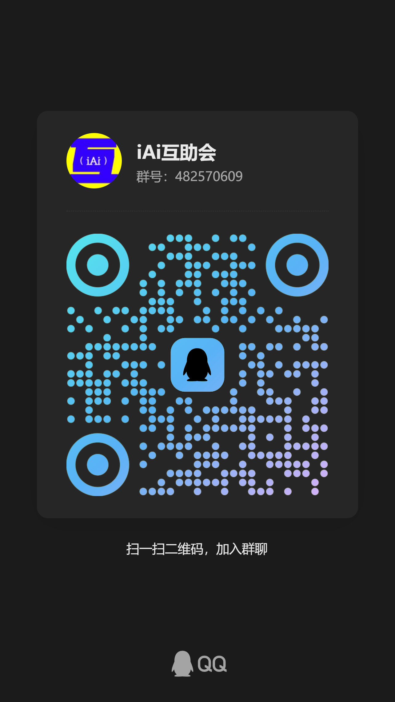

# ComfyUI-NO8D-controls

[English](./README.md) | 简体中文

该自定义节点组提供了从图像加载到图像生成的全链路节点优化方案，重点对图像生成、LoRA叠加、提示词生成等关键节点进行重塑，旨在简化comfyui的搭建流程，提高各节点的生成效率，大大降低了工作流搭建和使用的门槛。


## QQ 交流群

欢迎加入 **iAi互助会**，群号：`482570609`。

<p align="center">
  
</p>

## 安装

把仓库克隆到 ComfyUI 的 `custom_nodes` 目录：

```bash
cd ComfyUI/custom_nodes
git clone https://github.com/no8d/ComfyUI-NO8D-controls.git
```

安装后重启 ComfyUI，并在浏览器中强制刷新页面。不需要额外构建前端。

项目内置示例工作流：[examples/NO8D-controls-example.json](examples/NO8D-controls-example.json)。

也可以在 [Patreon](https://patreon.com/no8d) 关注 NO8D 的项目动态。

## 节点说明

所有节点位于 `NO8D-control` 或 `NO8D-controls` 分类。

### NO8D-Krea2风格选择

通过示意图浏览 Krea 2 风格，并输出当前选中风格的完整提示词。


- 将 285 种风格归入写实摄影、动漫插图、手绘艺术和数字艺术四个大类。
- 每页显示九宫格示意图，支持鼠标和键盘操作。
- 中文环境显示中文风格名称，同时保持原始英文提示词输出。

### NO8D-LoRA 堆栈

在一个节点中管理多个 LoRA，并在不接入 CLIP 的情况下应用到模型。


- 添加、删除、启用、关闭和排序 LoRA。
- 调整权重及滑条范围。
- 合并已启用 LoRA 的触发词并输出文本。

### NO8D-提示词

通过配置好的 API 扩写文本、反推参考图，或结合文本与图像生成完整正向提示词。


- 支持纯文本、纯图像和文本加图像三种输入。
- 提供风格、景别和提示词长度控制。
- 可分别选择文本模型和图像模型。

### NO8D-提示词预览

在发送到下游节点前显示和编辑提示词。


- 自动显示上游提示词。
- 可填写固定提示词，并在实际输出时作为固定前缀拼接。
- 支持手动编辑并一键发送到下游。
- 可暂停自动文本输出，同时保留编辑内容。

### NO8D-图像载入

载入并整理一张或多张本地图像，以 ComfyUI list 形式输出。


- 支持文件选择、拖拽和剪贴板粘贴。
- 每次导入后自动选中本批次的第一张图像。
- 可选择、排序和预览单张图像。
- 仅输出选中的图像；选中全部才输出全部，未选中任何图像时不输出。

### NO8D-生成

把 ComfyUI 采样控制、图像预览和遮罩局部重绘整合到一个紧凑节点中。


- 控制采样器、调度器、步数、CFG、降噪和种子。
- 支持画笔、套索、橡皮擦、羽化、透明度、反转和清除。
- 画布存在遮罩时自动执行局部重绘。
- 输出最终生成图像。

### NO8D-A/B 对比

通过可交互分割预览对比两路图像。


- 显示图像 A、图像 B 及其原始尺寸。
- 支持列表翻页和单路图像历史对比。
- 可把图像 A 传递到下游，也可关闭该输出分支。


### NO8D-多图拼接

把多路图片或图片批次拼接成一张图。

- 支持横向、纵向和自动网格拼接，并以第一张图的尺寸作为缩放基准。
- 提供标准、居左、居中和居右裁切；两张图组成的内容区域保持第一张图的尺寸。
- 裁切模式向外扩展画布绘制外边距和两图间距，不缩小图片内容，并使用背景颜色填充。
- 裁切结果服从拼接方向：横向左右排列，纵向上下排列，单列网格同样上下排列。
- 统一设置外边距与图片间距，网格留白自动使用加深后的背景色。

### NO8D-图片标题

在图片顶部或底部添加外置标题栏，或在图片中间叠加标题。

- 批次图片可通过逐行文本设置独立标题；全部为空时直接输出原图。
- 可控制标题底色、透明度、位置、高度、字号、间距、文字颜色和对齐。
- 顶部和底部会增加输出高度；中间标题保持原图尺寸。
- 图内顶部和图内底部覆盖在图片边缘，不改变输出尺寸。
- 标题栏透明度和高度均使用百分比；标题栏高度按输入图片高度计算。

### NO8D-图文保存

保存图像和对应文本，适合制作图文数据集。


- 用固定文本、原文件名、日期时间和尺寸等级组合文件名。
- 支持拖动调整命名部分的顺序。
- 为每张图像同时保存 caption 文本。

### NO8D-空 latent

按常见模型类型和画面比例创建空 latent。


- 支持 SD/SDXL、SD3/Flux/Krea2 和 Flux2 预设。
- 提供常用竖图和横图比例。
- 输出 latent 及计算后的宽度和高度。

## 支持项目

如果这个节点组对你有帮助，欢迎在 [Patreon](https://patreon.com/no8d) 关注项目动态并支持后续开发。你的支持将帮助节点持续维护和改进。

## 提示词 API

可在 NO8D 提示词设置面板中配置 API 服务、模型和提示词规则，支持 OpenAI 兼容接口和本地兼容接口。API key 仅保存在本地 ComfyUI 环境中，请勿提交到仓库。

## 许可证

MIT。详见 [LICENSE](./LICENSE)。
